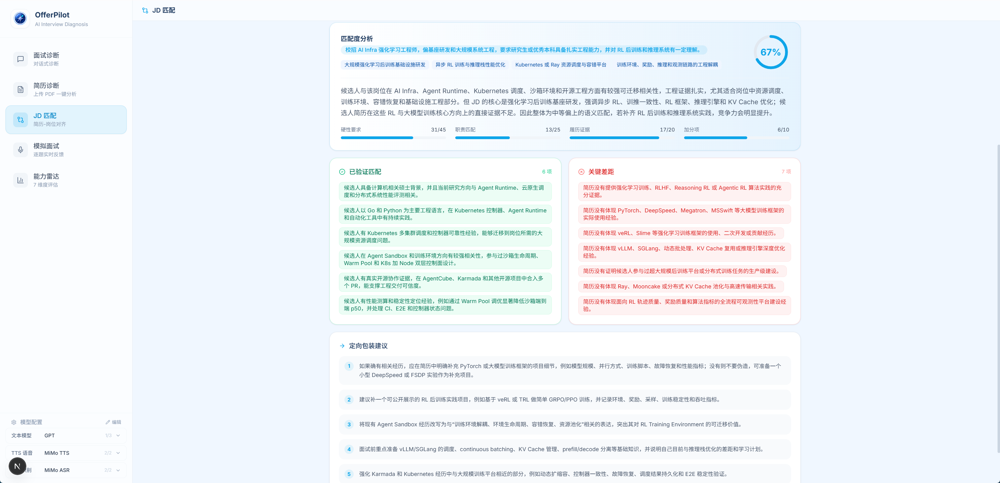
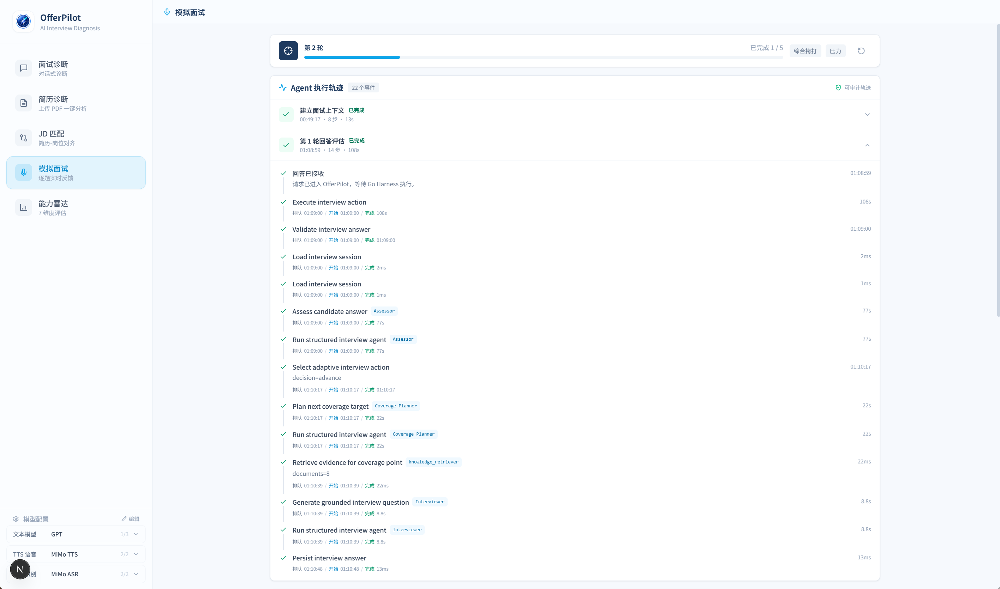
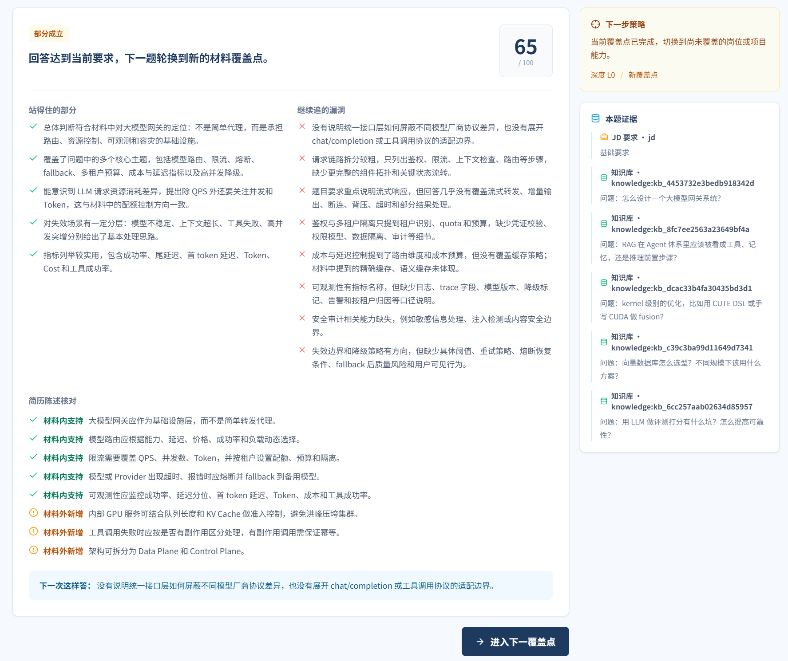

<div align="center">

# OfferPilot

**Make every AI / LLM engineering interview grounded, actionable, and measurable.**

An end-to-end AI interview agent for JD and resume analysis, adaptive mock interviews, voice diagnosis, and evidence-grounded reports.

[](https://github.com/ranxi2001/OfferPilot/actions/workflows/ci.yml)
[](https://github.com/ranxi2001/OfferPilot/releases)
[](./LICENSE)
[](./backend)
[](./package.json)

[中文](./README.md) · [Quick Start](#-quick-start) · [Features](#-features) · [Architecture](#-architecture) · [Changelog](./CHANGELOG.md)

</div>


> 🧩 **Job application companion: [OfferPilot-plugin](https://github.com/zlr930/OfferPilot-plugin)**
>
> Automatically fill resumes and online application forms with less repetitive data entry. OfferPilot prepares you for the interview; the companion extension helps you get there.

### ✨ Why OfferPilot?

- **Evidence-grounded**: reads the JD and resume together to generate questions, follow-ups, and assessments around real experience.
- **End-to-end workflow**: covers text diagnosis, voice answers, adaptive mock interviews, and Markdown / PDF reports.
- **Auditable agents**: exposes safe execution events and decision summaries without leaking private reasoning or sensitive material.
- **Production-oriented**: built on a Go typed Agent Harness and Next.js Web/BFF, without LangChain or LangGraph.

OfferPilot is also a practical implementation of the `zero2Agent` learning system, turning agent engineering concepts, interview knowledge, and architecture into a working application. The recommended server-backed deployment keeps LLM / ASR / TTS provider access behind the protected Go API.

## 🎬 Demo

### Evidence-Weighted JD Matching

After a JD and resume are uploaded, pasted, or fetched, the Go `resume_matcher` Harness Agent performs semantic scoring across hard requirements, responsibility alignment, resume evidence, and bonus qualifications. Results distinguish supported matches from material gaps and provide concrete preparation actions without relying on keyword intersection or fragmented phrases.



### Voice Answer Diagnosis

The Web UI supports recording or uploading an audio answer, transcribing it with Mimo ASR, then sending the transcript into the existing diagnosis agent. The audio is kept in the UI for replay and download so the same recording can be reused during testing.


### Auditable Execution Trace

Audio and mock-interview work is shown as a dedicated execution timeline instead of being rendered as duplicate chat messages. It preserves queued, running, completed, and failed steps with durations and safe decision summaries. Private model reasoning, prompts, JD/resume bodies, and knowledge reference answers are intentionally excluded.


### Complete Mock-Interview Agent Trace

Each answer keeps a continuous safe event history from receipt and validation through assessment, coverage planning, evidence retrieval, question generation, and persistence. This makes the Harness path and step timings directly inspectable.



### Evidence-Grounded Answer Feedback

Per-turn feedback presents supported points, remaining gaps, material checks, next-step strategy, and question evidence in one view so the basis for scoring and follow-up is visible.



### Markdown Report Output

Assistant answers render GitHub-Flavored Markdown, including tables. Each diagnosis response can be copied or saved as a `.md` file.


An exported sample report is available in [demo.md](./assets/demo.md).

## 🚀 v0.4.0 Semantic Matching And Dynamic Job Crawling

- Adds the Go `resume_matcher` Harness Agent for evidence-weighted semantic scoring across hard requirements, responsibilities, resume evidence, and bonus qualifications instead of keyword intersection.
- Adds the `web_crawler` Agent: known providers such as Alibaba and ByteDance use low-cost fast paths, while unknown SPAs enter a bounded Function Tool fallback.
- Correctly extracts Chinese CID-font PDFs through local CMaps and an explicit PDF.js worker, verified in both development and production builds.
- Reuses the same upload, paste, and URL material controls across JD matching and mock interviews.

[Full v0.4.0 changelog](./CHANGELOG.md#040---2026-08-29)

## 🧠 v0.3.3 Continuous Diagnosis and Knowledge Update

- Conversational diagnosis now preserves the interviewer's question, the candidate's answer, and prior feedback within the same session.
- Streaming output stops following when the user scrolls up, with a jump-to-latest control to resume.
- The interview knowledge base is synchronized with the latest [zero2Agent](https://github.com/ranxi2001/zero2Agent) content; the Go backend now loads 486 entries.

## 📚 v0.3.2 Mock Interview Review

- Export a self-contained `.html` review at any point during the interview or from the final report.
- Reviews include original questions, text answers or voice transcripts, answer recordings, per-turn analysis, standard answers, and knowledge evidence.
- Safe Agent execution traces include steps, status, duration, and decision summaries without exposing private chain-of-thought.
- A versioned `review` schema provides a stable integration point for future mistake clustering, skill trends, training plans, and review agents.
- Recordings stay in current-page memory and are embedded in the exported file. Text review remains available after refresh, but released recordings cannot be recovered.

[Full changelog](./CHANGELOG.md#032---2026-08-13)

## 🛠️ v0.3.1 Stability Patch

- Removes the obsolete `better-sqlite3` external-package configuration from Next.js.
- `npm run dev` now checks port `3000` and the Next.js development lock before startup, preventing stale processes from causing port drift, broken assets, or blank pages.
- The preflight reports conflicts but never terminates another process automatically.

[Full changelog](./CHANGELOG.md#031---2026-08-13)

## 🎉 v0.3.0 General Availability

OfferPilot's backend has moved from TypeScript to **Go**. The Go API now owns the typed Agent Harness, interview orchestration, per-question knowledge retrieval, SQLite persistence, and MiMo ASR / TTS. Next.js provides the Web/BFF and PDF, DOCX, and URL extraction.

- **More reliable**: idempotent answer commits, bounded execution after disconnects, session snapshot recovery, and a schema v3 execution ledger.
- **More trustworthy**: typed JD/resume evidence, per-question retrieval isolation, and constrained Interviewer, Assessor, and Reporter agents.
- **More observable**: safe execution traces, explicit readiness, stable error semantics, and an offline evaluation gate.
- **Complete voice workflow**: MiMo TTS by default, transient ASR retries, and failed-recording re-analysis.

[Full changelog](./CHANGELOG.md#030---2026-08-12) · [Deployment guide](./docs/deployment.md) · [Upgrade from Alpha](./docs/v0.3.0-alpha.2-release-verification.md)

## v0.3.0-alpha.2 Changes

- Interview question playback now uses MiMo TTS as the primary path with the official `mimo_default` voice; browser speech is only a fallback for service or playback failures.
- The Go API retries transient ASR failures such as EOF, timeouts, connection resets, `429`, and `5xx` responses up to three attempts. Ordinary `4xx` responses and canceled requests are not retried.
- The current question's original WAV stays in page memory after a failed transcription. “Re-analyze recording” reuses the exact audio and duration without asking the candidate to answer again.
- The Go API and Next.js BFF expose stable retry semantics while hiding provider URLs, credentials, EOF details, and internal response bodies.
- This patch has no database migration and continues to use schema v3. See [Alpha.2 release verification](./docs/v0.3.0-alpha.2-release-verification.md) for deployment and rollback boundaries.

## v0.3.0-alpha.1 Changes

- Added grounded typed Profile extraction for JD requirements, responsibilities, resume projects, ownership, and metrics.
- Scoped knowledge retrieval and private evidence independently for every interview question.
- Added stable browser `clientAnswerId` values and atomic SQLite answer commits. Identical retries replay one result; changed payloads and second answers conflict instead of being scored twice.
- Added durable command, event, model invocation, checkpoint, lease, and outbox persistence foundations with schema v3 migration.
- Added a deterministic CI Eval Harness with 30 cases, 90 globally unique questions, 121/121 valid evidence references, full mode/seniority matrix coverage, and zero known privacy-marker hits in 120 public fields.
- Detached bounded Go Harness runs from browser stream cancellation and added public session snapshot/event metadata recovery endpoints.
- This is an Alpha. Persistent SSE `Last-Event-ID` replay, stale worker takeover, production model quality studies, and complete server-side UI trace reconstruction remain future work.
- User-visible timelines contain safe execution facts and decision summaries, never private model chain-of-thought, prompts, reference answers, or raw JD/resume content.

See [Alpha release verification](./docs/v0.3.0-alpha.1-release-verification.md) before migrating or rolling back a deployment.

## v0.2.0 Changes

- Made Go the primary HTTP and Harness backend; `npm run serve:legacy` keeps the TypeScript API as a rollback path.
- Added JD and resume upload/paste/URL input with knowledge, project, and mixed interview modes.
- Replaced fixed question lists and mechanical `next` calls with atomic answer assessment plus adaptive follow-up.
- Moved semantic scoring into a typed Assessor; Go validates schema/evidence and applies deterministic policy only.
- Added claim verdicts: `supported`, `unverified`, `contradicted`, and `not_in_material`.
- The Go knowledge loader currently parses 404 question blocks from 36 Markdown files instead of trusting the stale 29-row database.
- Added the [Agent Harness and Go backend architecture](./docs/agent-harness-architecture.md) with editable draw.io source.
- Added real API testing path with `.env` auto-loading for CLI and API server.
- Added configurable OpenAI-compatible provider settings:
  - `OPENAI_API_KEY`
  - `OPENAI_BASE_URL`
  - `OPENAI_MODEL`
- Set the default chat model to `gpt-5.5`.
- Added Mimo audio integration:
  - ASR model: `mimo-v2.5-asr`
  - TTS model: `mimo-v2.5-tts`
  - official base URL: `https://api.xiaomimimo.com/v1`
- Added backend audio APIs:
  - `POST /api/transcribe`
  - `POST /api/tts`
- Added frontend proxy routes:
  - `web/src/app/api/transcribe`
  - `web/src/app/api/tts`
- Added browser-side WAV recording, because Mimo ASR expects `wav` or `mp3`.
- Added upload-audio diagnosis flow.
- Added process/thought-chain card for audio diagnosis.
- Added recording playback and download.
- Added Markdown table rendering with `remark-gfm`.
- Added answer actions: copy response and save as `.md`.
- Fixed diagnostician sub-agent recursion by disabling tools for the diagnostician sub-agent and limiting it to one iteration.
- Added Docker env pass-through for OpenAI-compatible and Mimo config.

## 🚀 Features

| Module | Capability | Status |
| --- | --- | --- |
| Interview diagnosis | Question + answer -> score, gaps, improvement plan | Done |
| Voice answer diagnosis | Record/upload audio -> ASR -> diagnosis | Done |
| Markdown report | Render tables, copy, save `.md` | Done |
| JD analysis | Extract skill stack, seniority signal, preparation focus | Done |
| Resume optimization | STAR, quantification, keywords, rewrite suggestions | Done |
| Resume-JD matching | Harness semantic scoring, evidence mappings, material gaps, seniority, and targeted preparation | Done |
| Adaptive mock interview | JD + resume evidence, semantic assessment, dynamic follow-up, report | Done |
| Realtime interview | TTS question, text/WAV answer, per-turn feedback | Done |
| Multi-agent runtime | Specialist sub-agents with concurrency pool | Done |
| Knowledge search | Atomic Markdown question blocks + in-memory BM25 | Done |

## 🏗️ Architecture

```text
backend/
  cmd/offerpilot-api/  Go API composition and graceful shutdown
  internal/harness/    typed agents, bounded concurrency, traces
  internal/interview/  evidence, assessment, policy, report aggregate
  internal/jobmatch/   evidence-weighted JD/resume semantic matching Agent
  internal/knowledge/  question-level Markdown parser and BM25 search
  internal/httpapi/    auth, CORS, SSE, limits, Web compatibility DTOs
  internal/llm/        OpenAI-compatible structured model gateway
  internal/speech/     MiMo ASR/TTS

web/                   Next.js UI/BFF and document extraction
```

See [Agent Harness and Go backend architecture](./docs/agent-harness-architecture.md) for the full design.
See the [v0.3.0 optimization plan](./docs/v0.3.0-optimization-plan.md) for prioritized work, acceptance metrics, and release gates.

## Model And Audio Configuration

Recommended setup:

- Text model: use the OpenAI-compatible endpoint from [ai.tosky.top](https://ai.tosky.top/) with `gpt-5.5` as the default model.
- Audio models: use the Xiaomi [MiMo Open Platform](https://platform.xiaomimimo.com?ref=6ENEDG), especially the MiMo V2.5 family.
  - ASR: `mimo-v2.5-asr`
  - TTS: `mimo-v2.5-tts`
  - TTS cost reference: about RMB 0.01 per minute.
  - Referral code: `6ENEDG`
  - Registration link: [https://platform.xiaomimimo.com?ref=6ENEDG](https://platform.xiaomimimo.com?ref=6ENEDG)
  - With the referral code, both sides receive RMB 10 API trial credit, first order gets 10% off, and trial credit is valid for 40 days.

Create `.env` from `.env.example` and fill in the keys you need.

```env
OPENAI_API_KEY=sk-...
OPENAI_BASE_URL=https://api.ai.tosky.top/v1
OPENAI_MODEL=gpt-5.5

MIMO_API_KEY=sk-...
MIMO_BASE_URL=https://api.xiaomimimo.com/v1
MIMO_ASR_MODEL=mimo-v2.5-asr
MIMO_TTS_MODEL=mimo-v2.5-tts
```

Notes:

- The Go backend uses an OpenAI-compatible text endpoint; the default chat model is `gpt-5.5`.
- OpenAI-compatible chat requests use `OPENAI_BASE_URL`.
- Mimo ASR/TTS uses the official `https://api.xiaomimimo.com/v1` base URL.
- Mimo ASR is implemented through `/chat/completions` with `input_audio`, following the official Mimo documentation.
- Browser recording is encoded as WAV before upload.

## ⚡ Quick Start

This project uses Go 1.26 and Node.js 24: Go runs the API and Agent Harness, while Node.js is used only by the Next.js Web/BFF.

```bash
cp .env.example .env
cd web && npm install && cd ..
```

Terminal 1: run the Go API:

```bash
cd backend
go run ./cmd/offerpilot-api
```

Terminal 2: run the Web UI:

```bash
cd web
npm run dev
```

If startup reports a busy port or `Another next dev server is already running`, find and stop the stale process first:

```powershell
netstat -ano | findstr :3000
taskkill /PID <PID> /F
```

Do not run multiple `next dev` processes from the same `web` directory. For release testing, use `npm run build && npm run start`.

Open:

```text
http://localhost:3000
```

API health check:

```text
http://localhost:3001/health/live
http://localhost:3001/health/ready
http://localhost:3000/api/health
```

`/health/live` only reports process liveness. Deployments and traffic gates must use `/health/ready`; it returns `503` when the model is unavailable, and interviews never commit a mechanical fallback score.

## Web Voice Diagnosis Flow

1. Click the microphone button in the chat input.
2. Speak your answer.
3. Click stop.
4. OfferPilot saves the recording in the process card.
5. The browser uploads WAV audio to `/api/transcribe`.
6. The server calls Mimo ASR.
7. The transcript is shown in the process card.
8. The transcript is sent to the diagnosis agent.
9. The response can be copied or saved as Markdown.

You can also upload an existing audio file with the attachment button.

## Docker

```bash
docker compose up -d
```

Services:

```text
API: http://localhost:3001
Web: http://localhost:3000
```

`docker-compose.yml` passes through OpenAI-compatible and Mimo environment variables.

Production deployment details are in [docs/deployment.md](./docs/deployment.md).

## Verification

Recent local verification:

```bash
cd backend && go test ./... && cd ..
npx vitest run tests/unit tests/e2e
npm --prefix web run build
git diff --check
```

Expected result:

```text
Go backend tests pass
Unit and E2E tests pass
Next.js production build passed
diff whitespace check passes
```

## Relationship With zero2Agent

OfferPilot uses the zero2Agent knowledge system as its interview knowledge source and applies the engineering ideas in a complete product-like agent:

```text
zero2Agent theory and interview knowledge
        |
        v
OfferPilot implementation
        |
        v
agent loop, tools, sessions, memory, web UI, ASR diagnosis
```

## License

[MIT](./LICENSE)
