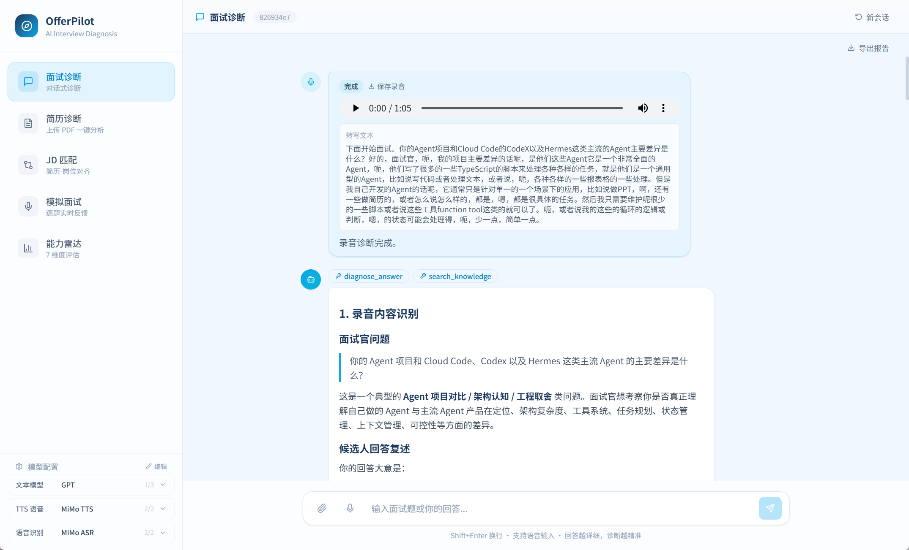
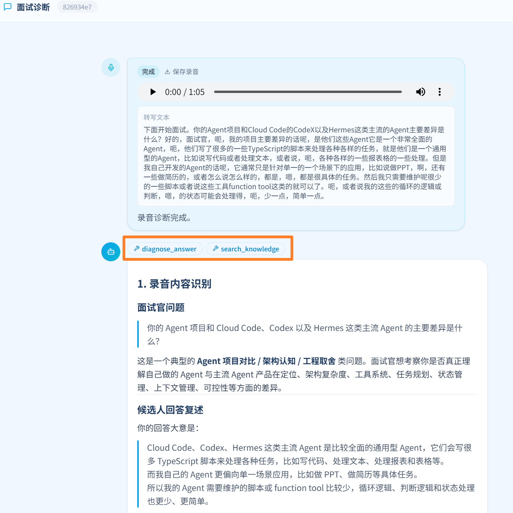
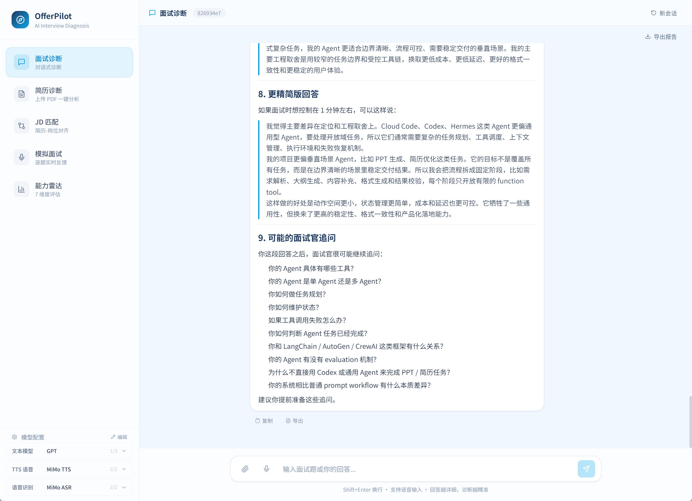

# OfferPilot

[English](./README-EN.md)

OfferPilot 是一个面向 AI Agent / LLM 工程面试的智能诊断 Agent。项目采用手写 Agent Loop，不依赖 LangChain / LangGraph，目标是把 Agent 工程里的模型调用、工具执行、上下文管理、会话状态、子 Agent、Web 流式交互和语音诊断串成一个完整产品原型。

项目同时也是 `zero2Agent` 学习体系的实战项目：把教程里的 Agent 工程知识、面试题库和架构拆解落地成可运行系统。


## Demo

### 录音回答诊断

前端支持直接录音或上传音频。系统会把录音转成 WAV，调用 Mimo ASR 转写，再把转写文本送入现有面试诊断 Agent。录音会保留在页面里，方便回放和下载复测。



### 思维链处理卡片

录音处理不会再伪装成重复的用户消息，而是单独展示为“思维链 / 处理流程”卡片。卡片会展示转写状态、诊断状态、录音播放器、录音下载和转写文本。



### Markdown 诊断报告

诊断结果支持 GitHub-Flavored Markdown，包含表格渲染。每条回答尾部提供复制和保存 `.md` 文档的快捷操作。



导出的示例报告见：[demo.md](./assets/demo.md)。

## 今日更新记录

- 打通真实 API 测试链路，CLI 和 API Server 启动时自动读取 `.env`。
- 增加 OpenAI 兼容模型配置：
  - `OPENAI_API_KEY`
  - `OPENAI_BASE_URL`
  - `OPENAI_MODEL`
- 默认聊天模型调整为 `gpt-5.5`。
- 接入 Mimo 音频能力：
  - ASR：`mimo-v2.5-asr`
  - TTS：`mimo-v2.5-tts`
  - 官方 Base URL：`https://api.xiaomimimo.com/v1`
- 新增后端音频 API：
  - `POST /api/transcribe`
  - `POST /api/tts`
- 新增前端代理路由：
  - `web/src/app/api/transcribe`
  - `web/src/app/api/tts`
- 浏览器录音改为导出 WAV，适配 Mimo ASR 的 `wav/mp3` 要求。
- 新增录音上传诊断流程。
- 新增录音诊断的思维链 / 处理流程卡片。
- 支持录音回放和录音下载。
- 使用 `remark-gfm` 支持 Markdown 表格渲染。
- Assistant 回答尾部新增复制和保存 `.md`。
- 修复 diagnostician 子 Agent 递归调用工具导致诊断卡住的问题。
- Docker Compose 透传 OpenAI 兼容模型和 Mimo 音频配置。

## 功能模块

| 模块 | 能力 | 状态 |
| --- | --- | --- |
| 面试诊断 | 输入问题和回答，输出评分、差距、改进建议 + CoT 思维链展示 | 已完成 |
| 录音回答诊断 | 录音/上传音频 → ASR → 诊断 | 已完成 |
| 实时模拟面试 | AI 逐题提问 → TTS 播报 → 录音/文字作答 → 即时缺陷分析 → 总结报告 | 已完成 |
| 简历分析 | 段落级诊断：STAR 结构、量化度、技术决策、个人贡献 | 已完成 |
| JD 匹配 | 关键词覆盖率、缺失项、职级判断、定向包装建议 | 已完成 |
| 能力雷达 | 7 维度评分 + 学习路径推荐 + 诊断历史追踪 | 已完成 |
| 报告导出 | Markdown / PDF 一键导出诊断报告 | 已完成 |
| 多 Agent 协作 | 专家子 Agent + 并发池 | 已完成 |
| 知识检索 | SQLite FTS5 + embedding 向量（路线: sqlite-vec → zvec/Qdrant） | 已完成 |

## 架构概览

```text
src/
  agent/            Agent Loop，负责工具执行和预算控制
  query-engine/     Provider 路由、流式输出、重试、结果收集
  query-engine/
    providers/      Claude / OpenAI-compatible / DeepSeek / Mock
  tools/            工具注册表和内置面试工具
  sub-agent/        子 Agent 运行时和并发池
  realtime/         ASR/TTS 集成与实时面试辅助模块
  knowledge/        Markdown 知识解析、FTS 检索、embedding
  context/          分层上下文和压缩
  memory/           会话级记忆
  permission/       工具风险控制和审计
  session/          会话状态和消息历史
  command/          CLI 命令解析
  hooks/            工具前后置 Hook
  db/               SQLite 持久化
  server.ts         HTTP API Server + SSE

web/
  src/app/          Next.js App Router 页面和 API 代理
  src/components/   Chat UI、侧边栏、输入框、消息渲染
```

## 模型与音频配置

推荐配置：

- 文本模型：推荐使用 [ai.tosky.top](https://ai.tosky.top/) 提供的 OpenAI 兼容接口，默认模型为 `gpt-5.5`。
- 语音模型：推荐使用 [小米 MiMo 开放平台](https://platform.xiaomimimo.com?ref=6ENEDG) 的 MiMo V2.5 系列模型。
  - ASR：`mimo-v2.5-asr`
  - TTS：`mimo-v2.5-tts`
  - TTS 成本参考：约 1 分钟 1 分钱。
  - 邀请码：`6ENEDG`
  - 注册链接：[https://platform.xiaomimimo.com?ref=6ENEDG](https://platform.xiaomimimo.com?ref=6ENEDG)
  - 通过邀请码注册，双方各得 10 元 API 体验金，首单 9 折；体验金有效期 40 天。

复制 `.env.example` 为 `.env`，按需填写 key。

```env
OPENAI_API_KEY=sk-...
OPENAI_BASE_URL=https://api.ai.tosky.top/v1
OPENAI_MODEL=gpt-5.5

MIMO_API_KEY=sk-...
MIMO_BASE_URL=https://api.xiaomimimo.com/v1
MIMO_ASR_MODEL=mimo-v2.5-asr
MIMO_TTS_MODEL=mimo-v2.5-tts

ANTHROPIC_API_KEY=sk-ant-...
DEEPSEEK_API_KEY=sk-...
```

说明：

- 默认聊天模型是 `gpt-5.5`。
- OpenAI 兼容模型走 `OPENAI_BASE_URL`。
- Mimo ASR/TTS 使用官方 `https://api.xiaomimimo.com/v1`。
- Mimo ASR 按官方文档通过 `/chat/completions` 的 `input_audio` 调用。
- 浏览器录音会先编码成 WAV，再上传给后端转写。

## 快速开始

建议使用 Node.js 20 或 22。Windows 下 Node.js 24 可能触发 `better-sqlite3` 原生依赖重编译。

```bash
npm install
cp .env.example .env
```

启动 API Server：

```bash
npm run serve
```

启动 Web UI：

```bash
cd web
npm install
npm run dev
```

打开：

```text
http://localhost:3000
```

健康检查：

```text
http://localhost:3001/health
```

## CLI 使用

交互式诊断：

```bash
npm start
```

单次诊断：

```bash
npm run diagnose -- -q "什么是 ReAct Agent？" -a "它会推理、调用工具、观察结果并继续迭代。"
```

构建知识库：

```bash
npm run build-kb
```

生成 embedding：

```bash
npm run embed
```

## Web 录音诊断流程

1. 点击输入框左侧麦克风按钮。
2. 说出面试回答。
3. 再次点击停止录音。
4. OfferPilot 在思维链卡片中保存录音。
5. 浏览器上传 WAV 到 `/api/transcribe`。
6. 后端调用 Mimo ASR。
7. 转写文本展示在思维链卡片中。
8. 转写文本进入面试诊断 Agent。
9. 诊断结果支持复制或保存为 Markdown。

也可以通过附件按钮上传已有音频文件。

## Docker

```bash
docker compose up -d
```

服务地址：

```text
API: http://localhost:3001
Web: http://localhost:3000
```

`docker-compose.yml` 已透传 OpenAI 兼容模型和 Mimo 音频相关环境变量。

## 验证

最近一次本地验证命令：

```bash
npm run build
npm test -- --run
cd web && npm run build
```

预期结果：

```text
11 个测试文件通过
55 个测试用例通过
Next.js 生产构建通过
```

## 与 zero2Agent 的关系

OfferPilot 使用 zero2Agent 的知识体系作为面试知识来源，并把 Agent 工程思想落地为完整应用：

```text
zero2Agent 理论与面试知识
        |
        v
OfferPilot 工程实现
        |
        v
Agent Loop、工具、会话、记忆、Web UI、ASR 诊断
```

## License

MIT
