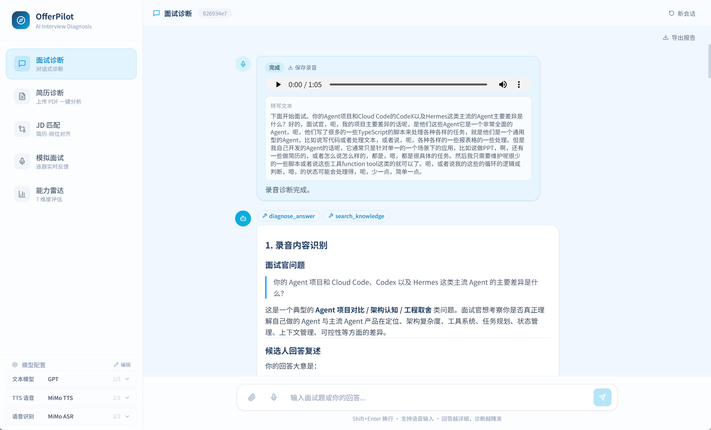
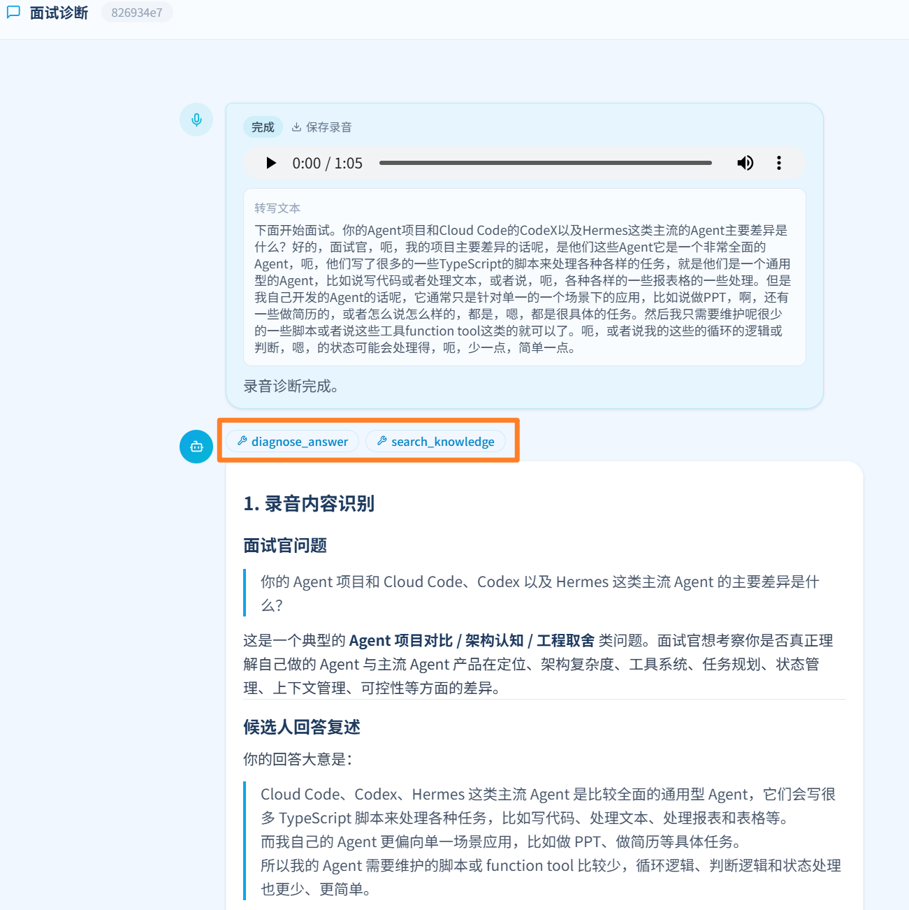
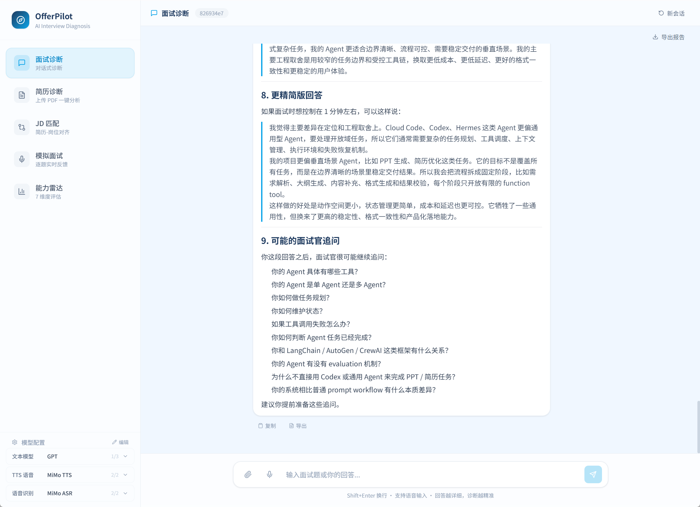

# OfferPilot

[English](./README-EN.md)

OfferPilot 是一个面向 AI Agent / LLM 工程面试的智能诊断 Agent。主后端使用 Go 实现 typed Agent Harness，不依赖 LangChain / LangGraph；Next.js 负责 Web/BFF 与文档解析，Node.js 24 继续承载前端和旧 CLI。

项目同时也是 `zero2Agent` 学习体系的实战项目：把教程里的 Agent 工程知识、面试题库和架构拆解落地成可运行系统。

当前推荐部署形态是 server-backed：浏览器访问 Next.js Web，Web 通过受保护的 Go API 调用 LLM / ASR / TTS provider。模拟面试会同时摄取 JD 与简历，按证据生成首题，并由 Interviewer、Assessor、Reporter 三个受约束子 Agent 驱动逐轮追问与报告。


## Demo

### 录音回答诊断

前端支持直接录音或上传音频。系统会把录音转成 WAV，调用 Mimo ASR 转写，再把转写文本送入现有面试诊断 Agent。录音会保留在页面里，方便回放和下载复测。



### 思维链处理卡片

录音处理不会再伪装成重复的用户消息，而是单独展示为“思维链 / 处理流程”卡片。卡片会展示转写状态、诊断状态、录音播放器、录音下载和转写文本。



### Markdown 诊断报告

诊断结果支持 GitHub-Flavored Markdown，包含表格渲染。每条回答尾部提供复制和保存 `.md` 文档的快捷操作。



导出的示例报告见：[demo.md](./assets/demo.md)。

## 今日更新记录

- Go 成为主 HTTP/Harness 后端；旧 TypeScript API 通过 `npm run serve:legacy` 保留为回滚入口。
- 模拟面试支持上传、粘贴或抓取 JD 与简历，并可选择知识拷打、项目深挖或混合模式。
- `answer` 原子返回本题结构化评估和下一道自适应问题，不再使用固定题单或机械 `next`。
- Assessor 按语义生成 typed rubric；Go 仅校验 schema/证据并执行追问策略，不按字数、数字或关键词打分。
- 简历与回答声明标记为 `supported / unverified / contradicted / not_in_material`，不会把候选人自述冒充外部事实。
- 知识库启动时动态解析 Markdown：当前 36 个文件得到 403 个独立题块，不再沿用旧 SQLite 的 29 条残缺记录。
- 新增 [Agent Harness 与 Go 后端架构文档](./docs/agent-harness-architecture.md) 和可编辑 draw.io 图。
- 打通真实 API 测试链路，CLI 和 API Server 启动时自动读取 `.env`。
- 增加 OpenAI 兼容模型配置：
  - `OPENAI_API_KEY`
  - `OPENAI_BASE_URL`
  - `OPENAI_MODEL`
- 默认聊天模型调整为 `gpt-5.5`。
- 接入 Mimo 音频能力：
  - ASR：`mimo-v2.5-asr`
  - TTS：`mimo-v2.5-tts`
  - 官方 Base URL：`https://api.xiaomimimo.com/v1`
- 新增后端音频 API：
  - `POST /api/transcribe`
  - `POST /api/tts`
- 新增前端代理路由：
  - `web/src/app/api/transcribe`
  - `web/src/app/api/tts`
- 浏览器录音改为导出 WAV，适配 Mimo ASR 的 `wav/mp3` 要求。
- 新增录音上传诊断流程。
- 新增录音诊断的思维链 / 处理流程卡片。
- 支持录音回放和录音下载。
- 使用 `remark-gfm` 支持 Markdown 表格渲染。
- Assistant 回答尾部新增复制和保存 `.md`。
- 修复 diagnostician 子 Agent 递归调用工具导致诊断卡住的问题。
- Docker Compose 透传 OpenAI 兼容模型和 Mimo 音频配置。

## 功能模块

| 模块 | 能力 | 状态 |
| --- | --- | --- |
| 面试诊断 | 输入问题和回答，输出评分、差距、改进建议 + CoT 思维链展示 | 已完成 |
| 录音回答诊断 | 录音/上传音频 → ASR → 诊断 | 已完成 |
| 自适应模拟面试 | JD + 简历证据 → Agent 出题 → 语义评估 → 动态追问 → 证据化报告 | 已完成 |
| 简历分析 | 段落级诊断：STAR 结构、量化度、技术决策、个人贡献 | 已完成 |
| JD 匹配 | 关键词覆盖率、缺失项、职级判断、定向包装建议 | 已完成 |
| 能力雷达 | 7 维度评分 + 学习路径推荐 + 诊断历史追踪 | 已完成 |
| 报告导出 | Markdown / PDF 一键导出诊断报告 | 已完成 |
| 多 Agent 协作 | 专家子 Agent + 并发池 | 已完成 |
| 知识检索 | SQLite FTS5 + embedding 向量（路线: sqlite-vec → zvec/Qdrant） | 已完成 |

## 架构概览

```text
backend/
  cmd/offerpilot-api/  Go API 装配与优雅退出
  internal/harness/    typed 子 Agent、并发边界、trace、结构化输出
  internal/interview/  面试聚合、证据、评估、策略与报告
  internal/knowledge/  Markdown 逐题解析与 BM25 检索
  internal/httpapi/    鉴权、CORS、SSE、限额与前端兼容投影
  internal/llm/        OpenAI-compatible 模型网关
  internal/speech/     MiMo ASR/TTS

web/
  src/app/            Next.js App Router、BFF、PDF/DOCX/URL 解析
  src/components/     面试作战台、材料输入、Chat 与报告 UI

src/                  旧 TypeScript CLI/API，迁移期间保留
```

完整设计与迁移约束见 [Agent Harness 与 Go 后端架构](./docs/agent-harness-architecture.md)。

## 模型与音频配置

推荐配置：

- 文本模型：推荐使用 [ai.tosky.top](https://ai.tosky.top/) 提供的 OpenAI 兼容接口，默认模型为 `gpt-5.5`。
- 语音模型：推荐使用 [小米 MiMo 开放平台](https://platform.xiaomimimo.com?ref=6ENEDG) 的 MiMo V2.5 系列模型。
  - ASR：`mimo-v2.5-asr`
  - TTS：`mimo-v2.5-tts`
  - TTS 成本参考：约 1 分钟 1 分钱。
  - 邀请码：`6ENEDG`
  - 注册链接：[https://platform.xiaomimimo.com?ref=6ENEDG](https://platform.xiaomimimo.com?ref=6ENEDG)
  - 通过邀请码注册，双方各得 10 元 API 体验金，首单 9 折；体验金有效期 40 天。

复制 `.env.example` 为 `.env`，按需填写 key。

```env
OPENAI_API_KEY=sk-...
OPENAI_BASE_URL=https://api.ai.tosky.top/v1
OPENAI_MODEL=gpt-5.5

MIMO_API_KEY=sk-...
MIMO_BASE_URL=https://api.xiaomimimo.com/v1
MIMO_ASR_MODEL=mimo-v2.5-asr
MIMO_TTS_MODEL=mimo-v2.5-tts

ANTHROPIC_API_KEY=sk-ant-...
DEEPSEEK_API_KEY=sk-...
```

说明：

- Go 主后端当前使用 OpenAI-compatible 文本接口，默认聊天模型是 `gpt-5.5`。
- Claude / DeepSeek provider 暂由旧 CLI 和 `serve:legacy` 保留。
- OpenAI 兼容模型走 `OPENAI_BASE_URL`。
- Mimo ASR/TTS 使用官方 `https://api.xiaomimimo.com/v1`。
- Mimo ASR 按官方文档通过 `/chat/completions` 的 `input_audio` 调用。
- 浏览器录音会先编码成 WAV，再上传给后端转写。

## 快速开始

项目使用 Go 1.26 和 Node.js 24。`better-sqlite3` 只用于旧 CLI/API，已升级到支持 Node.js 24 的版本。

```bash
npm install
cd web && npm install && cd ..
cp .env.example .env
```

启动 API Server：

```bash
npm run serve
```

旧 TypeScript API 仅用于迁移回滚：

```bash
npm run serve:legacy
```

启动 Web UI：

```bash
cd web
npm install
npm run dev
```

打开：

```text
http://localhost:3000
```

健康检查：

```text
http://localhost:3001/health
http://localhost:3001/health/live
http://localhost:3001/health/ready
http://localhost:3000/api/health
```

`/health/live` 只表示进程存活；部署和流量入口必须使用 `/health/ready`。模型未配置时 readiness 返回 `503`，面试接口不会生成机械兜底评分。

## CLI 使用

交互式诊断：

```bash
npm start
```

单次诊断：

```bash
npm run diagnose -- -q "什么是 ReAct Agent？" -a "它会推理、调用工具、观察结果并继续迭代。"
```

构建知识库：

```bash
npm run build-kb
```

生成 embedding：

```bash
npm run embed
```

## Web 录音诊断流程

1. 点击输入框左侧麦克风按钮。
2. 说出面试回答。
3. 再次点击停止录音。
4. OfferPilot 在思维链卡片中保存录音。
5. 浏览器上传 WAV 到 `/api/transcribe`。
6. 后端调用 Mimo ASR。
7. 转写文本展示在思维链卡片中。
8. 转写文本进入面试诊断 Agent。
9. 诊断结果支持复制或保存为 Markdown。

也可以通过附件按钮上传已有音频文件。

## Docker

```bash
docker compose up -d
```

服务地址：

```text
API: http://localhost:3001
Web: http://localhost:3000
```

`docker-compose.yml` 已透传 OpenAI 兼容模型和 Mimo 音频相关环境变量。

生产部署说明见：[docs/deployment.md](./docs/deployment.md)。

## 验证

最近一次本地验证命令：

```bash
npm run build
npm run test:go
npx vitest run tests/unit tests/e2e
npm --prefix web run build
git diff --check
```

预期结果：

```text
Go 与旧 TypeScript 构建通过
Go 后端测试通过
单元测试和 E2E 测试通过
Next.js 生产构建通过
diff whitespace 检查通过
```

## 与 zero2Agent 的关系

OfferPilot 使用 zero2Agent 的知识体系作为面试知识来源，并把 Agent 工程思想落地为完整应用：

```text
zero2Agent 理论与面试知识
        |
        v
OfferPilot 工程实现
        |
        v
Agent Loop、工具、会话、记忆、Web UI、ASR 诊断
```

## License

[MIT](./LICENSE)
